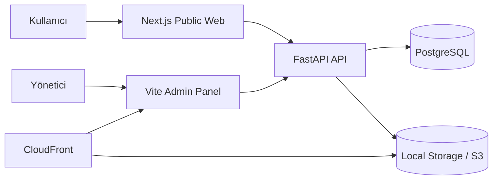

# CCK Kids Cloud Monorepo

CCK Kids / CCK Mobilya için geliştirilen bu repo; public web sitesi, yönetim paneli ve backend API'yi tek yerde toplayan cloud-ready bir monorepo yapısıdır. Proje, gerçek bir içerik yönetimi ve katalog senaryosunu hedefler: ürün ve proje içerikleri admin panelden yönetilir, public site bu verileri API üzerinden alır, medya dosyaları ise local storage veya AWS S3 üzerinden sunulabilir.

## Öne Çıkanlar

- FastAPI tabanlı RESTful backend
- Next.js tabanlı public web uygulaması
- Vite + React tabanlı admin panel
- PostgreSQL veri modeli ve Alembic migration yapısı
- Docker Compose ile lokal smoke test akışı
- AWS odaklı deployment tasarımı: `EC2 + RDS + S3 + CloudFront`

## Mimari Bakış



## Monorepo Yapısı

```text
cck-full/
├─ cck-mobilya-backend-main/       # FastAPI backend
├─ cckids-frontend-website-main/   # Next.js public web
├─ cckids-admin-main/              # Vite admin panel
├─ docs/                           # Takip edilen teknik dokümantasyon
├─ docs-local/                     # Lokal/course notları (gitignored)
├─ nginx/                          # Reverse proxy config
├─ docker-compose.local.yml        # Lokal smoke test stack
├─ docker-compose.prod.yml         # Production compose yapısı
└─ README.md
```

## Uygulama Katmanları

### 1. Backend API

`cck-mobilya-backend-main`

- FastAPI ile geliştirilmiştir
- Public ve admin endpoint'leri ayrı router yapısında tutulur
- SQLAlchemy modelleri ve Alembic migration yapısı içerir
- JWT tabanlı admin doğrulaması kullanır
- Local storage ve S3 destekli medya katmanı barındırır

### 2. Public Web

`cckids-frontend-website-main`

- Next.js App Router kullanır
- Ürün, proje, referans, iletişim ve kurumsal sayfaları sunar
- İçeriği backend API üzerinden çeker
- Çok dilli içerik akışını destekler

### 3. Admin Panel

`cckids-admin-main`

- Vite + React yapısındadır
- İçerik yönetimi için ayrı bir yönetim arayüzü sağlar
- Ürün, proje, kategori, renk, ana sayfa ve teklif yönetimi sunar
- Backend API'nin korumalı admin endpoint'lerine bağlanır

## Kullanılan Teknolojiler

| Katman | Teknolojiler |
| --- | --- |
| Backend | Python, FastAPI, SQLAlchemy, Alembic |
| Frontend | Next.js, React, TypeScript, Tailwind CSS |
| Admin | Vite, React, TypeScript, React Router |
| Data | PostgreSQL |
| DevOps | Docker, Docker Compose, Nginx |
| Cloud | AWS EC2, AWS RDS, AWS S3, AWS CloudFront, IAM |

## Lokal Geliştirme

Lokal smoke test için kullanılan ana dosyalar:

- `docker-compose.local.yml`
- `nginx/default.local.conf`
- `.env.local.compose.example`

İstersen örnek env dosyasını kopyalayarak başlayabilirsin:

```powershell
Copy-Item .env.local.compose.example .env.local.compose
```

Ardından stack'i ayağa kaldır:

```powershell
docker compose --env-file .env.local.compose -f docker-compose.local.yml up --build
```

Env dosyası oluşturmadan varsayılan değerlerle çalıştırmak istersen:

```powershell
docker compose -f docker-compose.local.yml up --build
```

Lokal erişim:

- Uygulama: `http://localhost:8080`
- API health: `http://localhost:8080/api/health`

## Production Yaklaşımı

Production tarafında hedeflenen dağıtım modeli aşağıdaki gibidir:

- `example.com` -> Next.js public web
- `api.example.com` -> FastAPI API
- `admin.example.com` -> admin panel, `S3 + CloudFront`
- `media.example.com` -> medya dosyaları, `S3 + CloudFront`

Ana servis sorumlulukları:

- `EC2`: web + api + nginx
- `RDS PostgreSQL`: veritabanı
- `S3`: admin build çıktılarını ve medya dosyalarını tutma
- `CloudFront`: admin ve medya dağıtımı

Detaylı kurulum yaklaşımı için:

- [docs/infra/AWS_DEPLOYMENT_PLAN.md](./docs/infra/AWS_DEPLOYMENT_PLAN.md)

## Repo İçindeki Önemli Dosyalar

- [docker-compose.local.yml](./docker-compose.local.yml)
- [docker-compose.prod.yml](./docker-compose.prod.yml)
- [docs/README.md](./docs/README.md)
- [docs/infra/AWS_DEPLOYMENT_PLAN.md](./docs/infra/AWS_DEPLOYMENT_PLAN.md)
- [docs/app/README.md](./docs/app/README.md)
- [cck-mobilya-backend-main/README.md](./cck-mobilya-backend-main/README.md)
- [cckids-frontend-website-main/README.md](./cckids-frontend-website-main/README.md)
- [cckids-admin-main/README.md](./cckids-admin-main/README.md)

## Repo Hijyen Notları

- Gerçek `.env` dosyaları repoya dahil edilmez
- Sertifika, private key ve benzeri dosyalar commit edilmez
- Build çıktıları ve lokal çalışma artefact'leri repodan ayrı tutulur
- Ders raporu, rollout kayıtları ve benzeri çalışma notları `docs-local/` altında tutulur

## Sonraki İyileştirme Fikirleri

- `docs/` klasörü altında teknik dokümanları toplayan ayrı bir yapı kurmak
- GitHub Actions ile temel lint/test akışı eklemek
- Root seviyesinde tek komutla çalışan bootstrap script'i hazırlamak
- Public demo, admin demo ve mimari ekran görüntülerini README'ye eklemek
